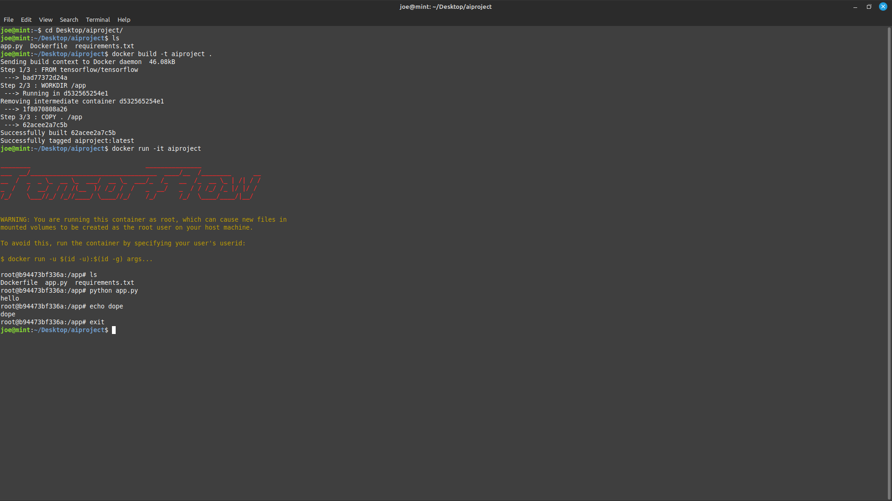

# AI Project

This repository holds my project for csuy 4613, [here](https://pantelis.github.io/artificial-intelligence/aiml-common/projects/nlp/finetuning-language-models-tweets/index.htm)

The project is set up in a docker container pulled from tensorflow/tensorflow to allow for TF development.

The Dockerfile was loaded 'FROM tensorflow/tensorflow, and was built as follows:

[here]: 